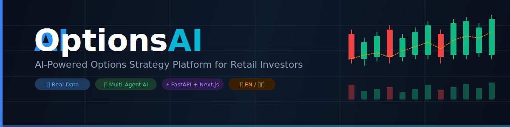
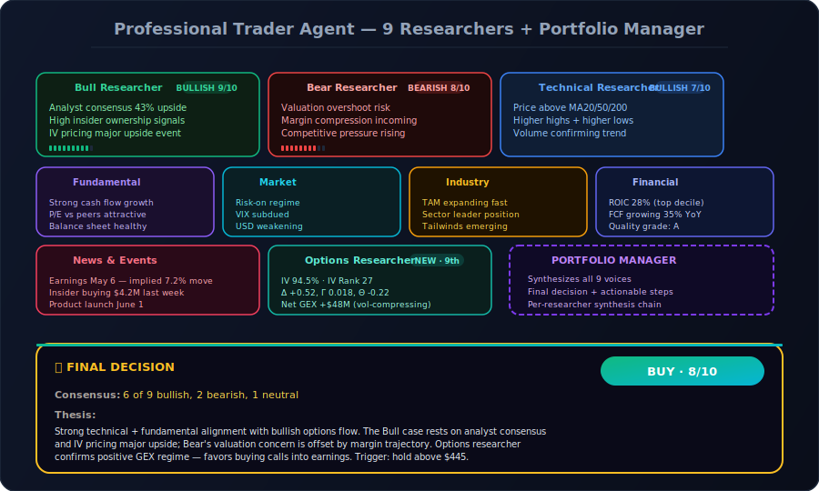
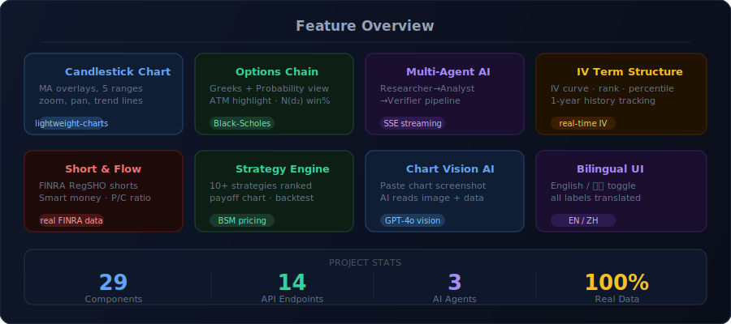
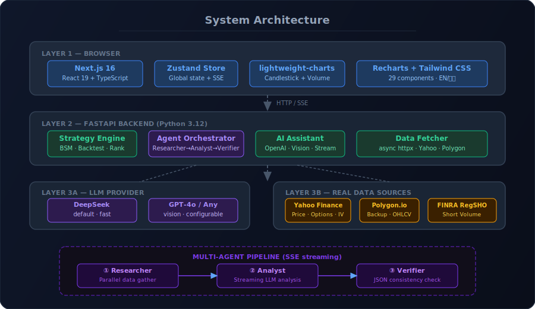
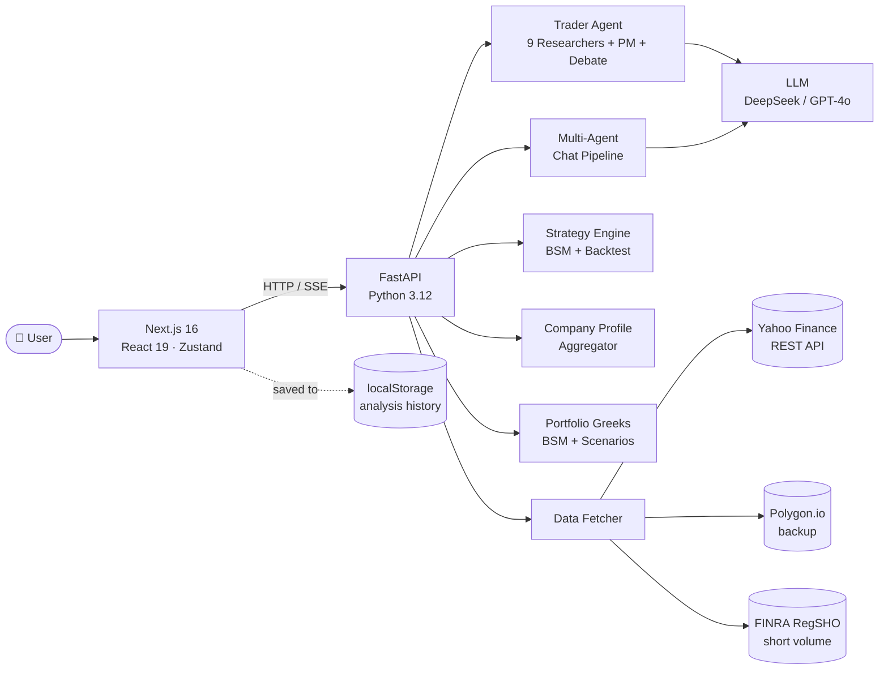

<div align="center">



<br/>

[](https://python.org)
[](https://fastapi.tiangolo.com)
[](https://nextjs.org)
[](https://typescriptlang.org)
[](LICENSE)

[](https://github.com/Jose-MUJOSE/optionsai/stargazers)
[](https://github.com/Jose-MUJOSE/optionsai/network)
[](https://github.com/Jose-MUJOSE/optionsai/commits)
[](https://github.com/Jose-MUJOSE/optionsai)

<br/>

**A multi-agent AI options strategy platform for retail investors.**  
9 specialist researchers · Bull/Bear debate · Portfolio Greeks · Scientific backtesting · Real US-market data · Bilingual UI

<br/>

[**🚀 Quick Start**](#-quick-start) · [**🤖 Trader Agent**](#-professional-trader-agent-v2-marquee-feature) · [**✨ Features**](#-features) · [**🏗 Architecture**](#-architecture) · [**📡 API**](#-api-reference)

</div>

---

## 📌 What is OptionsAI?

OptionsAI is a full-stack web platform that bridges the gap between raw options data and actionable decisions for **beginner retail investors** in the **US market**. Instead of staring at a wall of Greeks and IV numbers, users get:

- A **company identity card** — logo, sector, 18 valuation/profitability metrics, and a plain-language business summary — the moment they search any stock
- A step-by-step AI analysis from **9 specialist researchers** plus a **Portfolio Manager** that explains *why* a particular strategy makes sense, *what* the max loss is, and *where* the break-even point sits
- A **scientific backtest** with Sharpe ratio, Sortino, Max Drawdown, and transaction-cost-adjusted P&L — not just "the strategy made money"
- A **Portfolio Greeks dashboard** showing real-time Δ/Γ/Θ/ν across all paper positions, with 8 scenario shocks (±5%, ±10%, ±1σ IV, etc.)

> **Scope:** OptionsAI provides **analysis and educational recommendations only**. It does **not** execute trades, manage real portfolios, or constitute financial advice.  
> **Market:** US-listed stocks and ETFs only (A-shares, HK shares, forex, futures, crypto and indices are intentionally rejected with clear bilingual error messages).

---

## 🏢 Company Profile Card (Dashboard First-Look)

The first thing you see after searching any US stock is a rich **company identity card** — no more hunting through separate tabs to figure out what a company actually does.

| Section | Data shown |
|---------|-----------|
| **Identity** | Logo (Clearbit), long name, sector chip, industry chip, employee count |
| **Valuation** | Market Cap · P/E (TTM) · Forward P/E · P/B · Dividend Yield · Beta |
| **Profitability** | Revenue TTM · Gross Margin · Net Margin · Rev Growth YoY · ROE · P/S |
| **Advanced** | PEG Ratio · EV/EBITDA · Debt/Equity · Free Cash Flow |
| **Price range** | 52-week range bar with current-price dot |
| **Summary** | Collapsible business description (280-char preview, click to expand) |

All data is sourced from Yahoo Finance `quoteSummary` in a single parallel request. ETFs (SPY, QQQ, etc.) automatically hide the card — an ETF has no "business summary" to show.

---

## 🤖 Professional Trader Agent (v2 — Marquee Feature)



<br/>

The Trader Agent runs a **9-researcher debate** in parallel, then a **Portfolio Manager** synthesizes a final decision. The PM's output explicitly shows *how each researcher's voice was weighed*, so the user understands the full reasoning chain — not just the verdict.

### The 9 Researchers

| # | Researcher | What they look at |
|---|----------|-------------------|
| 1 | 📈 **Bull** | Strongest possible case for buying — catalysts, margin expansion, market share, valuation re-rating |
| 2 | 📉 **Bear** | Strongest possible case against — competitive pressure, margin compression, regulatory risk |
| 3 | 📊 **Technical** | Trend direction, MA stack, support/resistance, momentum, volume confirmation |
| 4 | 💼 **Fundamental** | Revenue growth, profitability, valuation vs peers, balance-sheet strength, FCF |
| 5 | 🌐 **Market** | Sector rotation, risk-on/risk-off regime, rates, VIX, USD direction |
| 6 | 🏭 **Industry** | TAM growth, competitive landscape, technological disruption, regulatory backdrop |
| 7 | 🧮 **Financial** | Earnings quality, ROIC, debt levels, working-capital efficiency, accounting red flags |
| 8 | 📰 **News & Events** | Recent headlines, earnings, product launches, insider transactions, 30-day catalyst |
| 9 | 🎯 **Options** | IV regime, IV Rank/Percentile, ATM Greeks, GEX dealer positioning, term structure |

### Bull/Bear Debate Phase

Before the PM makes a call, the platform runs a structured **debate round**: Bull and Bear researchers challenge each other's core claims with direct rebuttals. The PM then weighs in on which side had the stronger argument. This prevents the PM from rubber-stamping a consensus it hasn't stress-tested.

Each rebuttal card shows:
- 🗣 The original researcher's key claim
- ⚔️ The opposing rebuttal (1–2 sentences, specific)
- 🏆 PM judgment on who made the stronger point

### Researcher Selector

Run only the researchers you care about. Toggle individual researchers on/off before launching analysis — a single researcher can complete in ~15 seconds vs. ~60 seconds for all 9. Useful when you want a quick Technical + Options read without waiting for every researcher.

### What the Portfolio Manager produces

- **Decision badge** — `BUY` / `SELL` / `HOLD` or strategy name, plus conviction `1-10`
- **Consensus score** — *"6 of 9 bullish, 2 bearish, 1 neutral"*
- **Investment thesis** — 5-7 sentences with the full reasoning chain
- **Stock mode** — entry zone, target, stop loss, time horizon, position sizing
- **Options mode** — direction, exact structure (legs + premiums), expiration, max loss/profit, breakeven, win probability
- **Key catalysts + main risks** — 3 of each
- **Per-researcher synthesis** — how each of the 9 voices influenced the call
- **Actionable steps** — 3+ concrete next actions
- **Debate summary** — which side had the stronger bull/bear argument

### Persistence and history

- **Background-safe streaming** — switching views mid-analysis does not cancel the SSE stream
- **Auto-save to localStorage** — every completed analysis persisted (up to 30 entries) with timestamp + ticker + decision badge
- **History panel** — view, re-load, or delete past analyses
- **Word .docx download** — export the full report (manager + all 9 briefings + synthesis + steps)

---

## ✨ Features



<br/>

<table>
<tr>
<td width="50%">

**📊 Candlestick Chart**  
TradingView-quality OHLCV chart (`lightweight-charts`). MA5/10/20/30 overlays, 5 time ranges (1M–2Y), mouse-wheel zoom, pan, and manual trend-line drawing via click-to-draw.

</td>
<td width="50%">

**🔗 Full Options Chain**  
Dual-sided call/put table. Switch between **Greeks view** (Δ/Γ/Θ) and **Probability view** (Win%, Breakeven, Mid, OI). ATM row highlighted. Every column header has a plain-language tooltip for beginners.

</td>
</tr>
<tr>
<td width="50%">

**📐 Portfolio Greeks Dashboard**  
Real-time Δ/Γ/Θ/ν aggregated across all paper positions. **8 scenario shock tiles** show instant P&L impact: ±5%, ±10%, ±15% stock move, ±1σ IV shift, and theta decay scenarios. Per-position breakdown table with BSM full revaluation (not linear approximation).

</td>
<td width="50%">

**📈 Scientific Strategy Backtest**  
Walk-forward BSM simulation with full quantitative metrics:  
**Sharpe · Sortino · Calmar · Max Drawdown · Win Rate · Profit Factor · Cost-Adjusted P&L**  
Transaction costs (commissions + slippage) deducted from every simulated trade. Compare strategies on risk-adjusted return, not just raw P&L.

</td>
</tr>
<tr>
<td width="50%">

**🤖 Multi-Agent AI Chat**  
Three-stage pipeline with live status indicators:  
`Researcher` → parallel data collection  
`Analyst` → streaming LLM recommendation  
`Verifier` → auto-retry consistency check + ✓ badge

</td>
<td width="50%">

**📈 IV Term Structure**  
Implied volatility curve across all available expirations. IV Rank and IV Percentile vs. a full year of historical snapshots stored locally in SQLite.

</td>
</tr>
<tr>
<td width="50%">

**📉 Short & Flow Panel**  
Real FINRA RegSHO daily short volume · Yahoo Finance bi-weekly short interest · VWAP chip distribution estimate (⚠️ with disclaimer) · Institutional 13F ownership changes · Put/Call ratio from live OI.

</td>
<td width="50%">

**⚡ Strategy Engine + Interactive Payoff**  
Auto-selects the best strategy from your market outlook. **What-If mode**: drag strike and quantity sliders to see the payoff chart update in real time — no page reload needed.

</td>
</tr>
<tr>
<td width="50%">

**🎯 Strategy Scanner — 16 categories**  
Magnificent 7 · Dow 30 · S&P Top 50 · Nasdaq Top · Core ETFs · Semiconductors · AI Software · Banks · Healthcare · Energy · Consumer · EV & Auto · Biotech · China ADRs · Watchlist · Custom. Scan by high IV rank, bullish flow, or earnings proximity.

</td>
<td width="50%">

**📷 Multimodal Chart Vision**  
Paste or drag-drop a chart screenshot into the AI chat. The AI analyzes the image alongside live market data. Requires a vision-capable LLM (GPT-4o, Claude 3.5, etc.).

</td>
</tr>
<tr>
<td width="50%">

**📈 Dealer Gamma Exposure (GEX)**  
Strike-level GEX bar chart with positive/negative regime detection, Gamma Flip Strike, and dealer-positioning color coding. Helps spot vol-compressing vs vol-amplifying environments.

</td>
<td width="50%">

**🌍 Strict bilingual UI**  
Full English / 中文 toggle. Every label, explanation, tooltip, and AI response is available in both languages. Triple-redundant locale enforcement on every LLM call to prevent mixed output.

</td>
</tr>
</table>

**Plus:** Earnings move history · Unusual options flow · Watchlist · Paper portfolio · Event alerts · US-only ticker validation with bilingual rejection messages · Click-logo home navigation

---

## 🏗 Architecture



<br/>



---

## 🛠 Tech Stack

<table>
<tr><th>Layer</th><th>Technology</th><th>Purpose</th></tr>
<tr><td>Frontend</td><td><a href="https://nextjs.org">Next.js 16</a> + <a href="https://react.dev">React 19</a></td><td>App shell, routing, SSR</td></tr>
<tr><td>Styling</td><td><a href="https://tailwindcss.com">Tailwind CSS 4</a></td><td>Utility-first styling</td></tr>
<tr><td>State</td><td><a href="https://zustand-demo.pmnd.rs">Zustand 5</a></td><td>Global client state — keeps Trader Agent running across views</td></tr>
<tr><td>Charts</td><td><a href="https://tradingview.github.io/lightweight-charts/">lightweight-charts 5</a></td><td>Candlestick / OHLCV</td></tr>
<tr><td>Data viz</td><td><a href="https://recharts.org">Recharts 3</a></td><td>Payoff, IV, GEX, backtest, portfolio Greeks charts</td></tr>
<tr><td>Backend</td><td><a href="https://fastapi.tiangolo.com">FastAPI</a> + <a href="https://www.uvicorn.org">Uvicorn</a></td><td>REST API + SSE streaming</td></tr>
<tr><td>HTTP client</td><td><a href="https://www.python-httpx.org">httpx</a> (async)</td><td>Concurrent requests to data APIs</td></tr>
<tr><td>Numerical</td><td><a href="https://numpy.org">NumPy</a> + <a href="https://scipy.org">SciPy</a> + <a href="https://pandas.pydata.org">pandas</a></td><td>BSM pricing, Greeks, scenario shocks, backtest statistics</td></tr>
<tr><td>LLM</td><td>OpenAI-compatible API</td><td>DeepSeek / GPT-4o / Claude / any</td></tr>
<tr><td>Word reports</td><td><a href="https://python-docx.readthedocs.io">python-docx</a></td><td>Trader Agent .docx exports</td></tr>
<tr><td>Market data</td><td>Yahoo Finance REST + Polygon.io</td><td>Prices, options, IV, news, fundamentals, company profiles</td></tr>
<tr><td>Short data</td><td>FINRA RegSHO daily files</td><td>Real daily short volume</td></tr>
</table>

---

## 🚀 Quick Start

### Prerequisites

- Python **3.12+**
- Node.js **18+**
- A [DeepSeek](https://platform.deepseek.com) or [OpenAI](https://platform.openai.com) API key

### 1 · Clone and configure

```bash
git clone https://github.com/Jose-MUJOSE/optionsai.git
cd optionsai

# Copy config template and add your key
cp backend/.env.example backend/.env
```

Open `backend/.env` and set:
```env
DEEPSEEK_API_KEY=sk-your-key-here
DEEPSEEK_BASE_URL=https://api.deepseek.com/v1
```

### 2 · Install dependencies

```bash
# Backend
python -m venv venv
source venv/Scripts/activate        # Windows
# source venv/bin/activate          # macOS / Linux
pip install -r backend/requirements.txt

# Frontend
cd frontend && npm install && cd ..
```

### 3 · Run

```bash
# Terminal A — backend (port 8000)
venv/Scripts/python.exe -m uvicorn backend.main:app --reload --port 8000

# Terminal B — frontend (port 3000)
cd frontend && npm run dev
```

Open **[http://localhost:3000](http://localhost:3000)**, search a US ticker like `AAPL`, then:

1. **Dashboard** — company profile card → candlestick → IV term structure → options chain → GEX
2. **Trader Agent** — pick *Stock* or *Options* mode, select which researchers to run, hit **Run Analysis**, watch the Bull/Bear debate unfold
3. **Strategies** — ranked strategy recommendations + interactive payoff What-If + scientific backtest metrics
4. **Scanner** — pick a category (Mag7, Semiconductors, ETFs…) and a preset (high IV rank, bullish flow, earnings week)
5. **Paper Portfolio** — track positions and see live Portfolio Greeks with scenario shocks

> **Windows shortcut:** double-click `start.bat` to start both servers at once.

---

## ⚙️ Configuration

| Variable | Required | Description | Default |
|----------|:--------:|-------------|---------|
| `DEEPSEEK_API_KEY` | ✅ | LLM API key (any OpenAI-compatible) | — |
| `DEEPSEEK_BASE_URL` | ✅ | LLM endpoint | `https://api.deepseek.com/v1` |
| `POLYGON_API_KEY` | ☑️ | Polygon.io backup data | — |
| `HOST` | ➖ | Backend bind address | `0.0.0.0` |
| `PORT` | ➖ | Backend port | `8000` |

You can also swap LLM providers at runtime via the **⚙️ Settings** panel in the UI — no restart needed. Supports DeepSeek, GPT-4o, Claude (via OpenAI-compatible proxies), or any local model via Ollama.

---

## 📡 API Reference

All endpoints are prefixed with `/api`. Interactive Swagger docs: **[http://localhost:8000/docs](http://localhost:8000/docs)**

### Market data

| Method | Endpoint | Description |
|:------:|----------|-------------|
| `GET` | `/api/market-data/{ticker}` | Full market data snapshot (rejects non-US with HTTP 422) |
| `GET` | `/api/company-profile/{ticker}` | ★ Company identity, 18 metrics, business summary, logo |
| `GET` | `/api/ohlcv/{ticker}` | OHLCV bars for candlestick chart |
| `GET` | `/api/iv-term-structure/{ticker}` | IV curve across all expirations |
| `GET` | `/api/options-snapshot/{ticker}` | ATM Greeks snapshot |
| `GET` | `/api/expirations/{ticker}` | Available expiration dates |
| `GET` | `/api/short-data/{ticker}` | FINRA daily short volume + Yahoo short interest |
| `GET` | `/api/gex/{ticker}` | Dealer gamma exposure by strike |
| `GET` | `/api/earnings-moves/{ticker}` | Historical earnings move magnitudes |
| `GET` | `/api/unusual-flow/{ticker}` | Unusual options activity |

### Strategies & analysis

| Method | Endpoint | Description |
|:------:|----------|-------------|
| `POST` | `/api/strategies` | Generate ranked strategy recommendations |
| `POST` | `/api/backtest/{ticker}` | ★ Walk-forward backtest with Sharpe/Sortino/MDD/WinRate metrics |
| `POST` | `/api/portfolio/greeks` | ★ Aggregate Portfolio Greeks + 8 scenario P&L shocks |
| `POST` | `/api/scanner` | Multi-ticker opportunity scanner |
| `POST` | `/api/forecast/{ticker}` | AI price forecast |
| `POST` | `/api/market-intel/{ticker}` | News + analyst sentiment summary |

### AI agents

| Method | Endpoint | Description |
|:------:|----------|-------------|
| `POST` | `/api/chat/stream` | Multi-agent AI chat **(SSE)** |
| `POST` | `/api/trader/analyze/{ticker}` | ★ Trader Agent v2 — 9 researchers + debate + PM **(SSE)** |
| `POST` | `/api/trader/report` | Download Word .docx of a completed analysis |
| `GET`  | `/api/trader/researchers` | List the 9 researcher metadata (icons, colors, names) |

---

## 📂 Project Structure

```
optionsai/
├── backend/
│   ├── main.py                     # FastAPI app entry point
│   ├── requirements.txt
│   ├── .env.example                # ← copy to .env and fill keys
│   ├── models/schemas.py           # Pydantic request/response models
│   ├── routers/
│   │   ├── market_data.py          # Market data + company profile + backtest + portfolio Greeks
│   │   ├── chat.py                 # AI chat + SSE streaming
│   │   ├── strategies.py           # Strategy generation
│   │   ├── forecast.py             # Forecast + market intel
│   │   └── trader.py               # ★ Trader Agent + Word report
│   └── services/
│       ├── data_fetcher.py         # Yahoo Finance + Polygon.io async client
│       ├── ai_assistant.py         # LLM integration + vision support
│       ├── agent_orchestrator.py   # 3-stage Multi-Agent chat pipeline
│       ├── trader_agent.py         # ★ 9 researchers + PM + debate phase
│       ├── company_profile.py      # ★ Yahoo quoteSummary aggregator (18 metrics)
│       ├── portfolio_greeks.py     # ★ BSM Greeks + scenario P&L shocks
│       ├── researcher_context.py   # ★ Per-researcher data (MA/RSI/MACD/sector/news)
│       ├── ticker_validator.py     # US-only validation with bilingual errors
│       ├── strategy_engine.py      # Strategy selection logic
│       ├── strategy_selector.py    # Ranking and filtering
│       └── backtest_engine.py      # ★ BSM walk-forward backtest + Sharpe/MDD metrics
├── frontend/
│   └── src/
│       ├── app/page.tsx            # Main page layout
│       ├── components/
│       │   ├── CompanyProfile.tsx  # ★ Company identity card (logo, metrics, summary)
│       │   ├── TraderAgent.tsx     # ★ 9-researcher grid + debate + PM + history
│       │   ├── PortfolioGreeks.tsx # ★ Δ/Γ/Θ/ν tiles + 8 scenario shocks
│       │   ├── StrategyBacktest.tsx# ★ Sharpe/Sortino/MDD metrics panel
│       │   ├── PayoffChart.tsx     # ★ Interactive What-If payoff chart
│       │   ├── GEXPanel.tsx        # Gamma exposure
│       │   ├── StrategyScanner.tsx # 16-category scanner
│       │   └── ...                 # 25+ other components
│       ├── lib/
│       │   ├── store.ts            # Zustand store (company profile, Greeks, history)
│       │   ├── api.ts              # API client functions + TypeScript interfaces
│       │   ├── i18n.ts             # EN / 中文 translations
│       │   └── imageUpload.ts      # Canvas-based image resize
│       └── types/index.ts          # Shared TypeScript types
├── docs/images/                    # README assets (SVG diagrams)
├── start.bat                       # Windows: start both servers
└── stop.bat                        # Windows: stop both servers
```

---

## 🔍 Data Sources & Honesty

All data is fetched from real public sources. No mock data or fabricated numbers.

| Data Type | Source | Frequency | Notes |
|-----------|--------|-----------|-------|
| Price, options chain, IV | Yahoo Finance REST | Real-time | Primary source |
| Company profile, fundamentals | Yahoo Finance `quoteSummary` | Real-time | 6 modules per request |
| OHLCV bars | Yahoo Finance `v8/finance/chart` | Daily / intraday | |
| Backup prices & aggregates | Polygon.io | Real-time | Free tier |
| Daily short volume | **FINRA RegSHO** public files | Daily | Official exchange data |
| Short interest | Yahoo Finance `defaultKeyStatistics` | Bi-weekly | FINRA reporting cycle |
| Chip distribution | VWAP-weighted estimate from OHLCV | Calculated | ⚠️ Estimation, not real broker data |
| Institutional ownership | Yahoo Finance `institutionOwnership` (13F) | Quarterly | SEC filings |
| Trader Agent context | All of the above + ATM Greeks + GEX + MA/RSI/MACD | Per-analysis | Real-time snapshot |

> **Why US-only?** A-shares (`.SS` / `.SZ`) and HK shares (`.HK`) have no individual stock options. Forex, futures, crypto, and raw indices similarly have no retail-accessible options chains. The platform rejects these with HTTP 422 and a bilingual message suggesting the corresponding ETF or US ticker.

---

## 🗺 Roadmap

### Done ✅

- [x] Candlestick chart with MA overlays and trend-line drawing
- [x] Full options chain — Greeks view + Probability view + beginner tooltips
- [x] Multi-agent AI Chat pipeline — Researcher → Analyst → Verifier
- [x] **Trader Agent v2 — 9 specialist researchers + Portfolio Manager**
- [x] **Bull/Bear structured debate phase with per-claim rebuttals**
- [x] **Researcher selector** — run any subset of the 9 to save LLM cost
- [x] **Per-researcher synthesis + actionable steps + consensus score**
- [x] **Background-safe analysis (Zustand store)** — survives view switches
- [x] **Saved analysis history** — auto-persisted to localStorage
- [x] **Word .docx report download** — full Trader Agent export
- [x] **Company profile card** — logo, sector, 18 metrics, 52w range, business summary
- [x] **Portfolio Greeks dashboard** — Δ/Γ/Θ/ν aggregation + 8 scenario shocks
- [x] **Scientific backtest metrics** — Sharpe/Sortino/Calmar/MDD/WinRate/ProfitFactor
- [x] **Interactive payoff chart** — What-If mode with draggable strike/quantity sliders
- [x] IV term structure and IV rank / percentile history
- [x] Short interest + FINRA daily short volume panel
- [x] GEX (Gamma Exposure) by strike with regime detection
- [x] Earnings historical move analysis
- [x] Unusual options flow detection
- [x] Strategy scanner with 16 curated categories
- [x] Paper portfolio tracker + Watchlist
- [x] Bilingual UI — English / 中文 with strict locale enforcement
- [x] Multimodal chart image input to AI chat
- [x] US-only ticker validation with bilingual rejection messages

### Planned 🔜

- [ ] One-click deploy (Vercel + Railway)
- [ ] WebSocket real-time price updates
- [ ] Mobile-responsive layout
- [ ] PDF export alternative for Trader reports
- [ ] Options chain — multi-expiration comparison view
- [ ] Alerts push notifications (email / browser)

---

## 🤝 Contributing

Pull requests are welcome! For major changes, please open an issue first to discuss what you would like to change.

```bash
# 1. Fork and clone
git clone https://github.com/your-username/optionsai.git

# 2. Create a feature branch
git checkout -b feat/your-feature

# 3. Make changes, then commit
git commit -m "feat: add your feature"

# 4. Push and open a PR
git push origin feat/your-feature
```

---

## 📄 License

[MIT](LICENSE) — free to use, modify, and distribute.

---

<div align="center">

**Built with ❤️ using FastAPI · Next.js · DeepSeek · Yahoo Finance · python-docx**

If this project helped you, consider giving it a ⭐

[](https://star-history.com/#Jose-MUJOSE/optionsai&Date)

</div>
